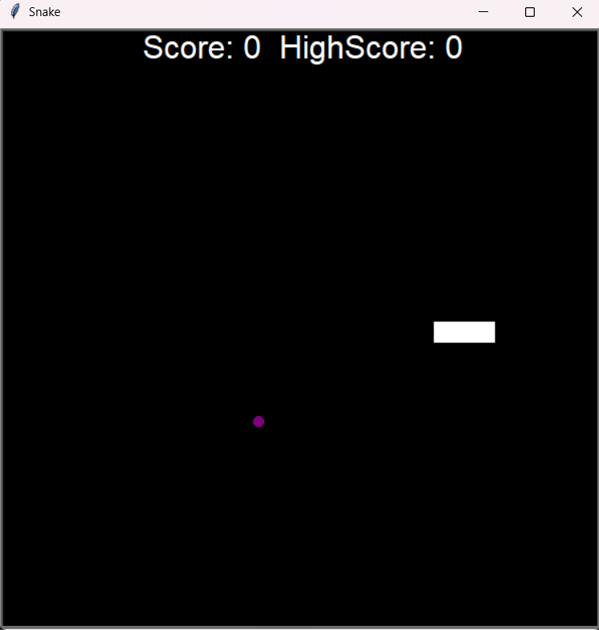

# 🐍 Snake Game  

A classic **Snake Game** built using Python and the **turtle** module! Control the snake using **W, A, S, D** keys, eat food to grow longer, and avoid collisions. The game keeps track of your **high score** to challenge you every time you play!  

## 🎮 Features  
- **Smooth Controls** – Control the snake using W, A, S, D keys.  
- **Food Mechanism** – The snake eats food to grow longer.  
- **High Score Tracking** – Keeps track of your best score even after restarting.  
- **Game Over Detection** – The game ends if the snake collides with itself or the wall.  

## 🛠 Requirements  
- Python 3.x installed  
- Required Python modules:  
  - `turtle` (built-in)  
  - `time` (built-in)  

## 🚀 How to Run  
1. Clone the repository:  
```bash
git clone https://github.com/anilsol159/Snake-Game.git
cd Snake-Game

## 🖼️ Game Screenshot  


